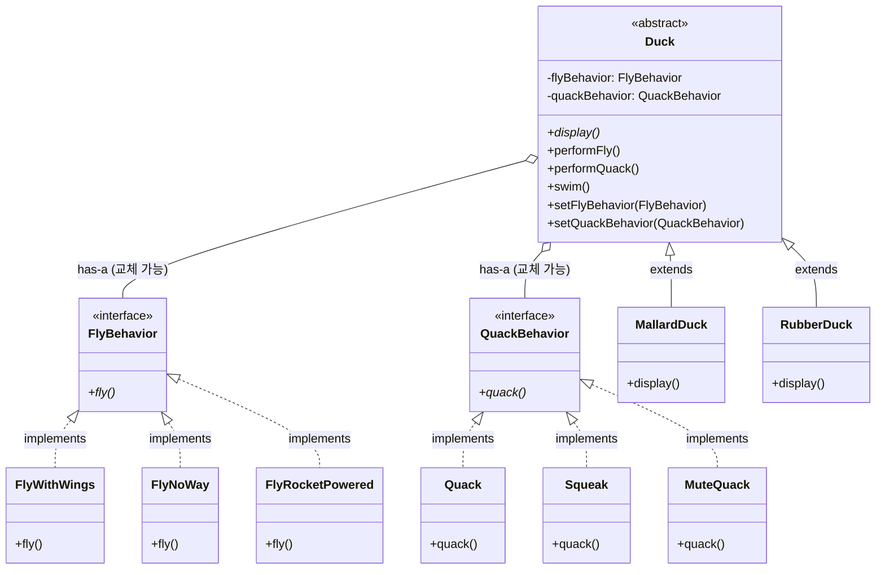

# Week 1. 전략(Strategy) 패턴

## 학습 정보

- **주차**: 1주차
- **챕터**: Chapter 1
- **패턴명**: 전략 패턴 (Strategy Pattern)
- **학습일**: 2025-02-10
- **학습 범위**: Chapter 1 전체

---

## 학습 목표

- 상속의 한계와 문제점을 이해하고, 이를 해결하는 방법을 학습한다.
- 전략 패턴의 개념과 구현 방법을 이해한다.
- 디자인 원칙 3가지를 학습하고 적용할 수 있다.

---

## 핵심 개념

### 패턴이 해결하는 문제

**발단**

Duck 클래스를 상속받아 여러 종류의 오리를 구현하던 중, 모든 오리에게 `fly()` 기능을 추가해야 하는 요구사항이 생긴다.

**문제 발생**

Duck 부모 클래스에 `fly()` 메서드를 추가하면 모든 자식 클래스가 이를 상속받는다. 그러나 고무오리, 가짜오리처럼 날 수 없는 오리도 `fly()`를 가지게 되는 문제가 생긴다.

**해결 시도 1: Override**

날 수 없는 오리 클래스에서 `fly()`를 오버라이드한다. 하지만 Duck의 모든 자식 클래스를 일일이 확인하고 수정해야 하므로 유지보수가 어렵다. 상속만으로는 해결이 안 된다.

**해결 시도 2: 인터페이스 분리**

`FlyBehavior`, `QuackBehavior` 인터페이스를 만들고 각 Duck 서브클래스에서 직접 구현한다. 그러나 날 수 있는 오리들이 각각 `fly()`를 중복 구현해야 하고, 행동 변경 시 해당 행동을 구현한 모든 클래스를 수정해야 한다. 코드 재사용이 안 되므로 인터페이스만으로도 부족하다.

**최종 해결: 전략 패턴 (행동의 구성)**

행동을 구현한 별도의 클래스를 만들어 캡슐화한다. Duck은 행동을 직접 구현하지 않고 행동 객체에 위임하며, setter 메서드로 런타임에 행동을 동적으로 변경할 수 있다.

### 패턴의 정의

> **전략 패턴(Strategy Pattern)** 은 알고리즘군을 정의하고 캡슐화하여 각각을 교체 가능하게 만든다. 전략 패턴을 사용하면 알고리즘을 사용하는 클라이언트와 독립적으로 알고리즘을 변경할 수 있다.

### 주요 구성요소

- **Context (Duck)**: 전략을 사용하는 역할. 행동을 직접 구현하지 않고 행동 인터페이스에 위임한다.
- **Strategy Interface (FlyBehavior, QuackBehavior)**: 알고리즘군의 공통 인터페이스를 정의한다.
- **Concrete Strategy (FlyWithWings, FlyNoWay, Quack, Squeak 등)**: 실제 알고리즘 구현체다.

---

## 패턴 구조

### UML 다이어그램



### 동작 방식

1. Duck 객체가 생성될 때 적절한 행동 객체(Strategy)를 할당받는다.
2. `performFly()`, `performQuack()` 호출 시 할당된 행동 객체에게 실행을 위임한다.
3. `setFlyBehavior()`, `setQuackBehavior()`로 런타임에 행동을 교체할 수 있다.
4. Duck은 구체적인 행동 구현을 알 필요 없이 인터페이스를 통해 행동을 위임한다.

---

## 코드 예제

### 예제 상황

오리 시뮬레이션 게임에서 다양한 종류의 오리를 구현한다. 각 오리의 날기와 소리내기 행동을 유연하게 변경할 수 있어야 한다.

### 전략 인터페이스와 구현체

```typescript
// 전략 인터페이스 정의
interface FlyBehavior {
  fly(): void;
}

interface QuackBehavior {
  quack(): void;
}

// 날기 전략 구현
class FlyWithWings implements FlyBehavior {
  fly(): void {
    console.log("날개로 날아갑니다!");
  }
}

class FlyNoWay implements FlyBehavior {
  fly(): void {
    console.log("저는 못 날아요.");
  }
}

class FlyRocketPowered implements FlyBehavior {
  fly(): void {
    console.log("로켓 추진으로 날아갑니다!");
  }
}

// 소리내기 전략 구현
class Quack implements QuackBehavior {
  quack(): void {
    console.log("꽥꽥!");
  }
}

class Squeak implements QuackBehavior {
  quack(): void {
    console.log("삑삑!");
  }
}

class MuteQuack implements QuackBehavior {
  quack(): void {
    console.log("< 조용... >");
  }
}
```

### Context 클래스와 구체 Duck

```typescript
abstract class Duck {
  protected flyBehavior: FlyBehavior;
  protected quackBehavior: QuackBehavior;

  constructor(flyBehavior: FlyBehavior, quackBehavior: QuackBehavior) {
    this.flyBehavior = flyBehavior;
    this.quackBehavior = quackBehavior;
  }

  abstract display(): void;

  // 행동을 직접 구현하지 않고 위임한다
  public performFly() {
    this.flyBehavior.fly();
  }

  public performQuack() {
    this.quackBehavior.quack();
  }

  public swim() {
    console.log("모든 오리는 물에 뜹니다.");
  }

  // 런타임에 행동을 교체할 수 있다
  public setFlyBehavior(fb: FlyBehavior) {
    this.flyBehavior = fb;
  }

  public setQuackBehavior(qb: QuackBehavior) {
    this.quackBehavior = qb;
  }
}

class MallardDuck extends Duck {
  constructor() {
    super(new FlyWithWings(), new Quack());
  }

  public display() {
    console.log("저는 청둥오리입니다.");
  }
}

class RubberDuck extends Duck {
  constructor() {
    super(new FlyNoWay(), new Squeak());
  }

  public display() {
    console.log("저는 고무오리입니다.");
  }
}
```

### 실행 코드

```typescript
const mallard = new MallardDuck();
mallard.display(); // 저는 청둥오리입니다.
mallard.performFly(); // 날개로 날아갑니다!
mallard.performQuack(); // 꽥꽥!

// 런타임에 행동 변경
mallard.setFlyBehavior(new FlyRocketPowered());
mallard.performFly(); // 로켓 추진으로 날아갑니다!

const rubber = new RubberDuck();
rubber.display(); // 저는 고무오리입니다.
rubber.performFly(); // 저는 못 날아요.
rubber.performQuack(); // 삑삑!
```

### 코드 설명

- Duck 클래스는 행동을 직접 구현하지 않고, 인터페이스 타입의 참조 변수를 통해 전략 객체에 위임(delegation)한다.
- 생성자로 초기 전략을 주입하고, setter로 런타임에 교체할 수 있다.
- 새로운 행동이 필요하면 Duck 클래스를 수정하지 않고 새로운 전략 클래스만 추가하면 된다.

---

## 구현 방식 비교

이 챕터에서는 같은 문제를 세 가지 방식으로 접근하며 전략 패턴에 도달한다. 각 방식의 한계를 비교하면 전략 패턴의 필요성을 명확히 이해할 수 있다.

| 구분            | 상속 (Override)                                         | 인터페이스 분리                                        | 전략 패턴 (구성)                       |
| --------------- | ------------------------------------------------------- | ------------------------------------------------------ | -------------------------------------- |
| 행동 변경 방법  | 서브클래스에서 메서드 오버라이드                        | 서브클래스에서 인터페이스 직접 구현                    | 별도 전략 객체에 위임                  |
| 코드 재사용     | 부모 클래스 코드를 재사용하지만 원치 않는 행동도 상속됨 | 재사용 불가 — 동일 행동도 각 클래스에서 중복 구현      | 전략 객체를 여러 Context에서 공유 가능 |
| 런타임 변경     | 불가능                                                  | 불가능                                                 | setter로 동적 교체 가능                |
| 새 행동 추가 시 | 모든 서브클래스 확인 및 오버라이드 필요                 | 해당 행동을 구현한 모든 클래스 수정                    | 새 전략 클래스만 추가                  |
| 결합도          | 높음 — 부모-자식 간 강한 결합                           | 중간 — 인터페이스로 분리했으나 구현은 각 클래스에 종속 | 낮음 — 인터페이스를 통한 느슨한 결합   |

---

## 실전 활용

### 언제 사용하면 좋을까?

- 관련된 알고리즘군이 있고, 런타임에 하나를 선택해야 할 때
- 같은 작업을 수행하지만 구현 방식이 다양한 경우
- 조건문(if-else, switch)이 복잡하게 얽혀 유지보수가 어려울 때
- 알고리즘의 변형이 필요하고, 클라이언트가 이를 선택해야 할 때

### 장단점

**장점**

- OCP(개방-폐쇄 원칙) 준수: 기존 코드 수정 없이 새로운 전략을 추가할 수 있다.
- 런타임에 알고리즘을 교체할 수 있다.
- 조건문 제거로 코드 가독성이 향상된다.
- 알고리즘을 사용하는 코드와 알고리즘 구현이 분리된다.

**단점**

- 클래스 수가 증가한다 (전략마다 별도 클래스가 필요).
- 클라이언트가 적절한 전략을 선택하려면 각 전략의 차이를 알아야 한다.
- 단순한 알고리즘에 적용하면 오버엔지니어링이 될 수 있다.

### 실제 적용 사례

- **결제 시스템**: 신용카드, PayPal, 카카오페이, 토스페이 등 다양한 결제 방식을 전략으로 캡슐화한다. 사용자가 선택한 결제 수단으로 동적 변경이 가능하다.
- **정렬 알고리즘**: 데이터 크기와 특성에 따라 QuickSort, MergeSort, BubbleSort 등을 선택한다. 정렬은 전략 패턴의 전형적인 적용 대상이다.
- **로깅 시스템**: 파일 저장, 데이터베이스 저장, 클라우드 전송 등 환경(개발/운영)에 따라 다른 로깅 전략을 사용한다.
- **압축 알고리즘**: ZIP, RAR, GZIP 등 다양한 압축 방식을 선택할 수 있다.
- **AI 추천 시스템**: 협업 필터링, 콘텐츠 기반 필터링 등 다양한 추천 알고리즘을 교체할 수 있다.

---

## 핵심 정리

- 전략 패턴은 변경되는 부분(알고리즘)을 캡슐화하여 런타임에 동적으로 교체 가능하게 만드는 패턴이다.
- 상속은 코드 재사용에 유리하지만, 행동 변경 측면에서 유연하지 못하다. 구성(Composition)을 활용하면 행동을 독립적으로 관리하고 교체할 수 있다.
- "바뀌는 부분을 찾아내고 바뀌지 않는 부분과 분리한다"는 원칙이 전략 패턴의 출발점이다.
- 인터페이스에 맞춰 프로그래밍하면 구체적인 구현에 의존하지 않으므로, 새로운 전략을 추가할 때 기존 코드를 수정할 필요가 없다.

---

## 함께 등장한 디자인 원칙

| 원칙                                                                     | 이 패턴에서의 적용                                                                              |
| ------------------------------------------------------------------------ | ----------------------------------------------------------------------------------------------- |
| 애플리케이션에서 달라지는 부분을 찾아내고, 달라지지 않는 부분과 분리한다 | 날기/소리내기 행동이 달라지는 부분이므로 Duck 클래스에서 분리하여 별도 클래스로 캡슐화한다      |
| 구현보다는 인터페이스에 맞춰서 프로그래밍한다                            | Duck은 FlyBehavior, QuackBehavior 인터페이스에 의존하며 구체 구현 클래스를 직접 참조하지 않는다 |
| 상속보다는 구성(Composition)을 활용한다                                  | Duck이 행동을 상속받는 대신, 행동 객체를 has-a 관계로 가지고 위임한다                           |

---

## 관련 패턴

- **상태(State) 패턴**: 전략 패턴과 구조가 거의 동일하다. 차이는 의도에 있다. 전략 패턴은 알고리즘을 교체하는 것이 목적이고, 상태 패턴은 객체의 내부 상태에 따라 행동이 바뀌는 것이 목적이다.
- **템플릿 메서드(Template Method) 패턴**: 알고리즘의 골격은 부모 클래스에 정의하고 일부 단계를 서브클래스에서 오버라이드한다. 전략 패턴이 구성(위임)으로 알고리즘 전체를 교체하는 반면, 템플릿 메서드는 상속으로 알고리즘의 일부 단계만 변경한다.
- **옵저버(Observer) 패턴**: 직접적인 관계는 없지만, 느슨한 결합이라는 공통 원칙을 공유한다. 2장에서 다룬다.
