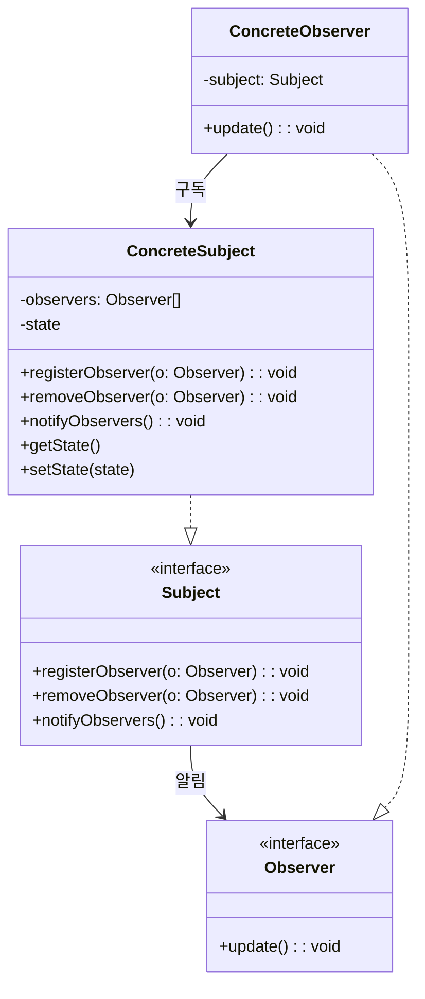

# Week 2. 옵저버(Observer) 패턴

## 학습 정보

- **주차**: 2주차
- **챕터**: Chapter 02 — 객체들에게 연락 돌리기
- **패턴명**: 옵저버 패턴 (Observer Pattern)
- **학습일**: 2025-02-24
- **학습 범위**: Chapter 02 전체

---

## 학습 목표

- 옵저버 패턴의 정의와 일대다(one-to-many) 관계를 이해한다.
- 느슨한 결합(Loose Coupling)이 왜 중요한지, 옵저버 패턴에서 어떻게 구현되는지 파악한다.
- 푸시(Push) 방식과 풀(Pull) 방식의 차이를 이해하고, TypeScript로 직접 구현한다.

---

## 핵심 개념

### 패턴이 해결하는 문제

웹 애플리케이션에서 하나의 데이터가 변경되었을 때 여러 화면 요소가 동시에 갱신되어야 하는 상황이 흔하다.
<br />
이때 가장 단순한 접근은 데이터를 가진 객체가 각 화면 요소를 직접 호출하는 것이다.

```typescript
// 문제가 있는 코드 — 구체적인 구현에 의존
public measurementsChanged() {
  const temp = this.getTemperature();
  const humidity = this.getHumidity();
  const pressure = this.getPressure();

  this.currentConditionsDisplay.update(temp, humidity, pressure);
  this.statisticsDisplay.update(temp, humidity, pressure);
  this.forecastDisplay.update(temp, humidity, pressure);
}
```

이 방식에는 다음과 같은 문제가 있다.

- 인터페이스가 아닌 구체적인 구현에 의존하고 있다.
- 새로운 디스플레이가 추가될 때마다 코드를 직접 수정해야 한다.
- 실행 중에 디스플레이를 동적으로 추가하거나 제거할 수 없다.
- 바뀌는 부분이 캡슐화되어 있지 않다.

옵저버 패턴은 이 문제를 "구독" 메커니즘으로 해결한다.

### 패턴의 정의

> **옵저버 패턴(Observer Pattern)** 은 한 객체의 상태가 바뀌면 그 객체에 의존하는 다른 객체에게 연락이 가고 자동으로 내용이 갱신되는 방식으로 **일대다(one-to-many) 의존성**을 정의한다.

신문사(Subject)와 구독자(Observer)의 관계로 비유할 수 있다.

- **신문사(주제)**: 상태를 가지고 있으며, 변경이 발생하면 모든 구독자에게 알린다.
- **구독자(옵저버)**: 주제에 등록하여 알림을 받고, 원하면 언제든 구독을 해지한다.

### 주요 구성요소

- **Subject (주제 인터페이스)**: 옵저버를 등록/제거/알림하는 메서드를 정의한다.
- **Observer (옵저버 인터페이스)**: 주제의 상태가 변경되었을 때 호출되는 `update()` 메서드를 정의한다.
- **ConcreteSubject (구상 주제)**: Subject를 구현하며, 상태를 저장하고 변경 시 옵저버에게 알린다.
- **ConcreteObserver (구상 옵저버)**: Observer를 구현하며, 주제의 상태 변경에 대한 구체적인 동작을 정의한다.

---

## 패턴 구조

### UML 다이어그램



### 동작 방식

1. **등록**: 옵저버가 주제에 자신을 등록한다 (`registerObserver`).
2. **상태 변경**: 주제의 내부 상태가 변경된다.
3. **알림**: 주제가 등록된 모든 옵저버의 `update()`를 호출한다 (`notifyObservers`).
4. **갱신**: 각 옵저버는 `update()` 내부에서 필요한 데이터를 처리한다.
5. **해지**: 더 이상 알림이 필요 없는 옵저버는 구독을 해지한다 (`removeObserver`).

---

## 코드 예제

### 예제 상황

Weather-O-Rama 사의 기상 스테이션 프로젝트다.
<br />
`WeatherData` 객체가 온도, 습도, 기압 데이터를 관리하고, 여러 디스플레이(현재 조건, 기상 통계, 기상 예보)가 데이터 변경 시 자동으로 갱신되어야 한다.
<br />
새로운 디스플레이를 쉽게 추가할 수 있는 확장 가능한 구조가 요구된다.

### 인터페이스 정의

```typescript
/** 주제 인터페이스 — 옵저버를 등록/제거/알림하는 책임을 가진다 */
export interface Subject {
  registerObserver(o: Observer): void;
  removeObserver(o: Observer): void;
  notifyObservers(): void;
}

/** 옵저버 인터페이스 — 주제의 상태 변경 알림을 받는다 */
export interface Observer {
  update(): void;
}

/** 디스플레이 인터페이스 — 화면에 표시하는 책임을 가진다 */
export interface DisplayElement {
  display(): void;
}
```

### 주제 구현: WeatherData

```typescript
export class WeatherData implements Subject {
  private observers: Observer[] = [];
  private temperature: number = 0;
  private humidity: number = 0;
  private pressure: number = 0;

  public registerObserver(o: Observer) {
    this.observers.push(o);
  }

  public removeObserver(o: Observer) {
    this.observers = this.observers.filter((observer) => observer !== o);
  }

  public notifyObservers() {
    for (const observer of this.observers) {
      observer.update();
    }
  }

  public measurementsChanged() {
    this.notifyObservers();
  }

  public setMeasurements(temp: number, humidity: number, pressure: number) {
    this.temperature = temp;
    this.humidity = humidity;
    this.pressure = pressure;
    this.measurementsChanged();
  }

  // 옵저버가 풀(Pull) 방식으로 데이터를 가져갈 수 있도록 게터를 제공한다
  public getTemperature() {
    return this.temperature;
  }

  public getHumidity() {
    return this.humidity;
  }

  public getPressure() {
    return this.pressure;
  }
}
```

### 옵저버 구현: 디스플레이

```typescript
/** 현재 조건 디스플레이 */
export class CurrentConditionsDisplay implements Observer, DisplayElement {
  private temperature: number = 0;
  private humidity: number = 0;

  constructor(private weatherData: WeatherData) {
    this.weatherData.registerObserver(this);
  }

  public update() {
    // 풀 방식: 필요한 데이터만 주제로부터 가져온다
    this.temperature = this.weatherData.getTemperature();
    this.humidity = this.weatherData.getHumidity();
    this.display();
  }

  public display() {
    console.log(`현재 상태: 온도 ${this.temperature}F, 습도 ${this.humidity}%`);
  }
}

/** 기상 통계 디스플레이 */
export class StatisticsDisplay implements Observer, DisplayElement {
  private temperatures: number[] = [];

  constructor(private weatherData: WeatherData) {
    this.weatherData.registerObserver(this);
  }

  public update() {
    this.temperatures.push(this.weatherData.getTemperature());
    this.display();
  }

  public display() {
    const avg =
      this.temperatures.reduce((a, b) => a + b, 0) / this.temperatures.length;
    const max = Math.max(...this.temperatures);
    const min = Math.min(...this.temperatures);
    console.log(`평균/최고/최저 온도 = ${avg}/${max}/${min}`);
  }
}

/** 기상 예보 디스플레이 */
export class ForecastDisplay implements Observer, DisplayElement {
  private currentPressure: number = 29.92;
  private lastPressure: number = 0;

  constructor(private weatherData: WeatherData) {
    this.weatherData.registerObserver(this);
  }

  public update() {
    this.lastPressure = this.currentPressure;
    this.currentPressure = this.weatherData.getPressure();
    this.display();
  }

  public display() {
    if (this.currentPressure > this.lastPressure) {
      console.log("기상 예보: 날씨가 좋아지고 있습니다!");
    } else if (this.currentPressure === this.lastPressure) {
      console.log("기상 예보: 지금과 비슷할 것 같습니다.");
    } else {
      console.log("기상 예보: 쌀쌀하며 비가 올 것 같습니다.");
    }
  }
}
```

### 실행 코드

```typescript
const weatherData = new WeatherData();

const currentDisplay = new CurrentConditionsDisplay(weatherData);
const statisticsDisplay = new StatisticsDisplay(weatherData);
const forecastDisplay = new ForecastDisplay(weatherData);

weatherData.setMeasurements(80, 65, 30.4);
weatherData.setMeasurements(82, 70, 29.2);
weatherData.setMeasurements(78, 90, 29.2);
```

**실행 결과**

```
현재 상태: 온도 80F, 습도 65%
평균/최고/최저 온도 = 80/80/80
기상 예보: 날씨가 좋아지고 있습니다!
현재 상태: 온도 82F, 습도 70%
평균/최고/최저 온도 = 81/82/80
기상 예보: 쌀쌀하며 비가 올 것 같습니다.
현재 상태: 온도 78F, 습도 90%
평균/최고/최저 온도 = 80/82/78
기상 예보: 지금과 비슷할 것 같습니다.
```

### 코드 설명

- **풀(Pull) 방식 채택**: `update()`에 매개변수를 넘기지 않고, 옵저버가 주제의 게터 메서드를 통해 필요한 데이터만 가져온다. 주제에 새로운 상태(예: 풍속)가 추가되어도 기존 옵저버의 `update()` 시그니처를 변경할 필요가 없다.
- **생성자에서 자동 등록**: 각 디스플레이는 생성 시 `weatherData.registerObserver(this)`를 호출하여 스스로 옵저버로 등록한다.
- **관심사 분리**: `Observer`는 알림 수신, `DisplayElement`는 화면 표시 책임을 분리하여 각 인터페이스가 하나의 역할만 담당한다.

---

## 푸시(Push) vs 풀(Pull)

옵저버 패턴의 데이터 전달 방식은 크게 두 가지로 나뉜다.

| 구분        | 푸시(Push)                                                                  | 풀(Pull)                                                               |
| ----------- | --------------------------------------------------------------------------- | ---------------------------------------------------------------------- |
| 데이터 전달 | 주제가 `update(temp, humidity, pressure)` 형태로 모든 데이터를 넘긴다       | 주제가 `update()`만 호출하고, 옵저버가 게터로 필요한 데이터를 가져간다 |
| 확장성      | 주제에 새 상태가 추가되면 모든 옵저버의 `update()` 시그니처를 수정해야 한다 | 게터 메서드만 추가하면 되므로 기존 옵저버에 영향이 없다                |
| 결합도      | 옵저버가 주제의 상태 구조를 알 필요 없지만, 불필요한 데이터도 받게 된다     | 옵저버가 주제의 게터 메서드를 알아야 하지만, 필요한 것만 가져간다      |
| 권장 여부   | 단순한 구조에서 빠르게 구현할 때                                            | 일반적으로 더 권장되는 방식                                            |

---

## 느슨한 결합 (Loose Coupling)

옵저버 패턴이 강력한 이유는 주제와 옵저버 사이의 **느슨한 결합** 때문이다.

> **디자인 원칙**: 상호작용하는 객체 사이에는 가능하면 느슨한 결합을 사용해야 한다.

옵저버 패턴에서 느슨한 결합이 성립하는 이유는 다음과 같다.

- **주제는 옵저버의 구체적인 클래스를 모른다.** Observer 인터페이스를 구현한다는 사실만 알면 된다.
- **옵저버는 언제든 추가/제거할 수 있다.** 주제는 Observer 목록만 관리하므로 실행 중에도 동적으로 변경 가능하다.
- **새로운 형식의 옵저버가 추가되어도 주제를 수정할 필요가 없다.** Observer 인터페이스만 구현하면 어떤 클래스든 옵저버로 참여할 수 있다.
- **주제와 옵저버는 독립적으로 재사용할 수 있다.** 서로 단단하게 결합되어 있지 않기 때문이다.

---

## 실전 활용

### 언제 사용하면 좋을까?

- 하나의 객체 상태 변화가 다른 여러 객체에 자동으로 반영되어야 할 때
- 런타임에 관찰 대상을 동적으로 추가/제거해야 할 때
- 발행자와 구독자 사이의 결합도를 낮추고 싶을 때

### 장단점

**장점**

- 주제와 옵저버가 느슨하게 결합되어 독립적으로 변경/확장 가능하다.
- 실행 중에 옵저버를 자유롭게 추가하거나 제거할 수 있다.
- 개방-폐쇄 원칙(OCP)을 준수한다 — 주제 코드를 수정하지 않고 새로운 옵저버를 추가할 수 있다.

**단점**

- 옵저버가 많아지면 알림 순서를 예측하기 어렵다 (순서에 의존하면 안 된다).
- 주제-옵저버 간 순환 참조가 발생할 수 있으므로 메모리 관리에 주의해야 한다.
- 단순한 상태 변경에도 모든 옵저버에게 알림이 가므로 불필요한 갱신이 발생할 수 있다.

### 실제 적용 사례

- **브라우저 DOM 이벤트**: `addEventListener` / `removeEventListener`가 옵저버 패턴의 전형적인 구현이다. 버튼(Subject)에 클릭 리스너(Observer)를 등록하고, 클릭 시 모든 리스너에게 알림이 간다.
- **Node.js EventEmitter**: `on()`, `off()`, `emit()` 메서드로 이벤트 기반 옵저버 패턴을 구현한다.
- **RxJS Observable**: 비동기 데이터 스트림에 대한 옵저버 패턴의 확장 구현이다.
- **React 상태 관리**: 상태(state) 변경 시 해당 상태를 구독하는 컴포넌트가 자동으로 리렌더링된다.

---

## 핵심 정리

- 옵저버 패턴은 주제(Subject)와 옵저버(Observer) 사이에 일대다 관계를 정의한다. 주제의 상태가 바뀌면 모든 옵저버에게 자동으로 알림이 간다.
- 주제와 옵저버는 느슨하게 결합되어 있다. 주제는 옵저버가 Observer 인터페이스를 구현한다는 것만 알면 된다.
- 데이터 전달은 푸시(Push)와 풀(Pull) 두 가지 방식이 있으며, 일반적으로 풀 방식이 확장성 면에서 더 유리하다.
- 옵저버 패턴의 핵심 디자인 원칙은 "상호작용하는 객체 사이에는 가능하면 느슨한 결합을 사용해야 한다"이다.

---

## 함께 등장한 디자인 원칙

| 원칙                                                | 이 패턴에서의 적용                                                     |
| --------------------------------------------------- | ---------------------------------------------------------------------- |
| 바뀌는 부분은 캡슐화한다                            | 옵저버 목록과 알림 로직을 Subject 인터페이스로 캡슐화                  |
| 상속보다는 구성을 활용한다                          | 옵저버는 상속이 아닌 인터페이스 구현 + 주제 참조(구성)로 관계를 맺는다 |
| 구현보다는 인터페이스에 맞춰서 프로그래밍한다       | Subject와 Observer 모두 인터페이스를 통해 상호작용한다                 |
| 상호작용하는 객체 사이에서는 느슨한 결합을 사용한다 | 주제는 옵저버의 구체 클래스를 모르고, Observer 인터페이스에만 의존한다 |

---

## 관련 패턴

- **출판-구독(Publish-Subscribe) 패턴**: 옵저버 패턴과 유사하지만, 구독자가 서로 다른 유형의 메시지에 관심을 가질 수 있고 미들웨어(메시지 브로커)를 통해 더 세밀하게 분리된다. 옵저버 패턴의 확장된 형태로 볼 수 있다.
- **중재자(Mediator) 패턴**: 객체 간 통신을 중앙의 중재자 객체가 조정한다. 옵저버 패턴의 알림이 일방향(주제 → 옵저버)인 반면, 중재자는 양방향 통신을 조정한다.
- **MVC 패턴**: 모델(Model)이 주제, 뷰(View)가 옵저버 역할을 한다. 모델의 상태 변경이 뷰에 자동 반영되는 구조에서 옵저버 패턴이 핵심으로 사용된다.
