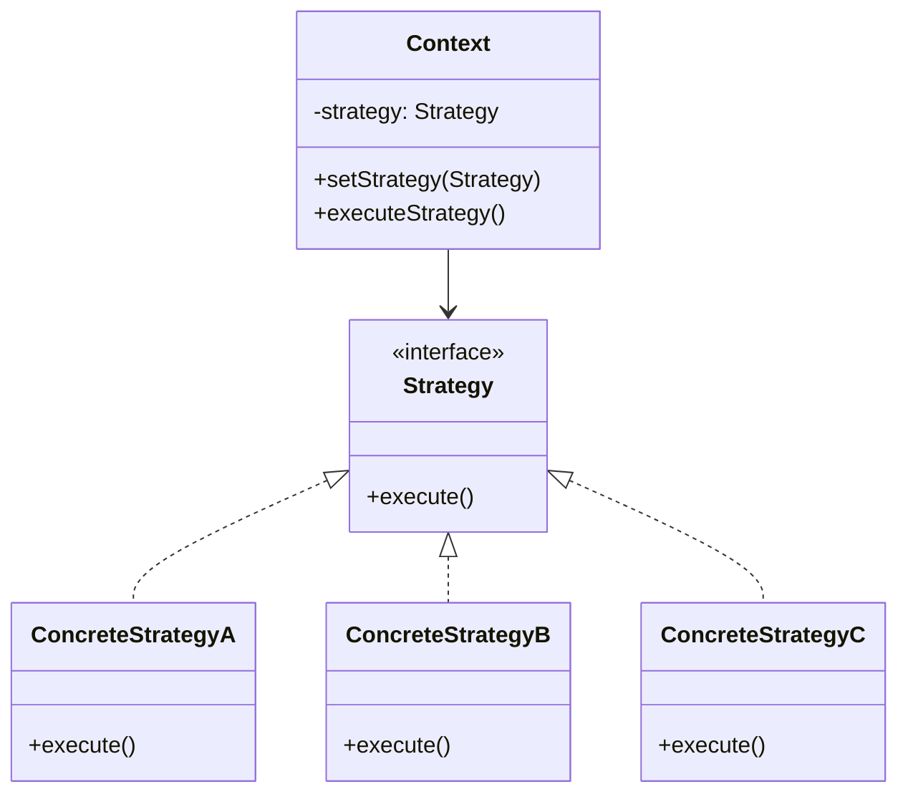
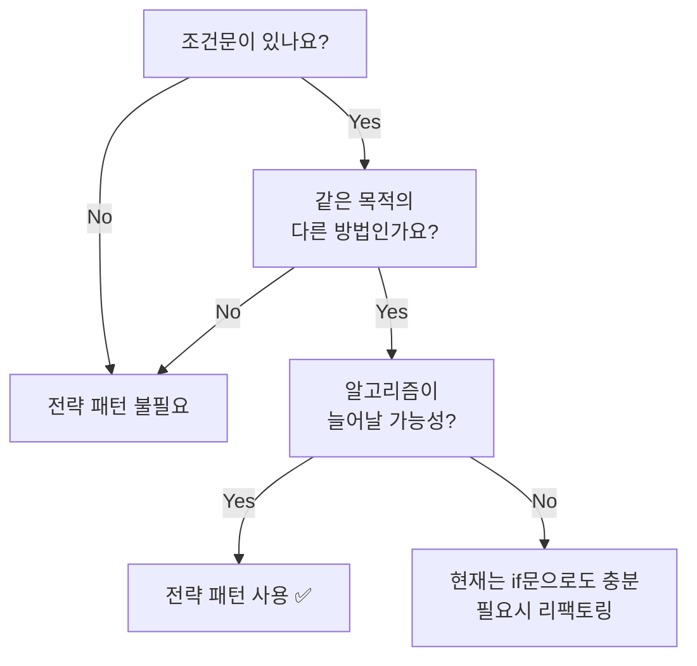

# 전략 패턴 (Strategy Pattern)

> "알고리즘군을 정의하고 각각을 캡슐화하여 교환해서 사용할 수 있도록 만든다. 전략 패턴을 활용하면 알고리즘을 사용하는 클라이언트와는 독립적으로 알고리즘을 변경할 수 있다." - GoF

## 📌 왜 전략 패턴이 필요한가?

### 문제 상황

다양한 결제 수단을 지원하는 결제 시스템을 만든다고 가정해봅시다.
```javascript
class PaymentService {
  processPayment(amount, paymentType) {
    if (paymentType === 'card') {
      console.log(`${amount}원 카드 결제 완료`);
    } else if (paymentType === 'bank') {
      console.log(`${amount}원 계좌이체 완료`);
    } else if (paymentType === 'kakao') {
      console.log(`${amount}원 카카오페이 결제 완료`);
    } else if (paymentType === 'naver') {
      console.log(`${amount}원 네이버페이 결제 완료`);
    }
  }
}
```

**문제점:**
1. 새로운 결제 수단 추가 시 기존 코드 수정 필요 (OCP 위반)
2. 조건문이 늘어날수록 복잡도 증가
3. 테스트하기 어려움
4. 결제 로직 재사용 불가능

## 🎯 전략 패턴으로 해결하기

전략 패턴은 **알고리즘을 객체로 캡슐화**하여 런타임에 교체 가능하게 만듭니다.

### 구조


### JavaScript 구현
```javascript
// 1. 구체적인 전략들
class CardPayment {
  pay(amount) {
    console.log(`${amount}원 카드 결제 완료`);
  }
}

class KakaoPayment {
  pay(amount) {
    console.log(`${amount}원 카카오페이 결제 완료`);
  }
}

// 2. Context - 전략을 사용하는 주체
class PaymentService {
  constructor(strategy) {
    this.strategy = strategy;
  }

  setStrategy(strategy) {
    this.strategy = strategy;
  }

  processPayment(amount) {
    return this.strategy.pay(amount);
  }
}

// 3. 사용
const paymentService = new PaymentService(new CardPayment());
paymentService.processPayment(10000);

// 런타임에 전략 변경
paymentService.setStrategy(new KakaoPayment());
paymentService.processPayment(20000);
```

## 💡 JavaScript다운 방식

JavaScript는 일급 함수를 지원하므로, 더 간결하게 작성할 수 있습니다.
```javascript
// 전략들을 함수로 정의
const paymentStrategies = {
  card: (amount) => console.log(`${amount}원 카드 결제 완료`),
  bank: (amount) => console.log(`${amount}원 계좌이체 완료`),
  kakao: (amount) => console.log(`${amount}원 카카오페이 결제 완료`)
};

// Context
class PaymentService {
  constructor(strategyName = 'card') {
    this.strategy = paymentStrategies[strategyName];
  }

  setStrategy(strategyName) {
    this.strategy = paymentStrategies[strategyName];
  }

  processPayment(amount) {
    return this.strategy(amount);
  }
}
```

## 🛠 실전 예제

### 1. 폼 검증 전략
```javascript
const validationStrategies = {
  required: (value) => ({
    isValid: value.trim() !== '',
    message: '필수 입력 항목입니다.'
  }),
  
  email: (value) => ({
    isValid: /^[^\s@]+@[^\s@]+\.[^\s@]+$/.test(value),
    message: '올바른 이메일 형식이 아닙니다.'
  }),
  
  minLength: (min) => (value) => ({
    isValid: value.length >= min,
    message: `최소 ${min}자 이상 입력해주세요.`
  })
};

class FormValidator {
  constructor() {
    this.validators = [];
  }

  addValidation(strategy) {
    this.validators.push(strategy);
    return this;
  }

  validate(value) {
    for (const validator of this.validators) {
      const result = validator(value);
      if (!result.isValid) return result;
    }
    return { isValid: true };
  }
}

// 사용
const emailValidator = new FormValidator()
  .addValidation(validationStrategies.required)
  .addValidation(validationStrategies.email);

emailValidator.validate('test@test.com');
```

### 2. 정렬 전략
```javascript
const sortStrategies = {
  byName: (a, b) => a.name.localeCompare(b.name),
  byPrice: (a, b) => a.price - b.price,
  byDate: (a, b) => new Date(b.createdAt) - new Date(a.createdAt)
};

const products = [
  { name: '노트북', price: 1200000, createdAt: '2024-01-15' },
  { name: '마우스', price: 30000, createdAt: '2024-02-01' }
];

products.sort(sortStrategies.byPrice);
```

### 3. API 호출 전략
```javascript
const apiStrategies = {
  rest: {
    get: (url) => fetch(url).then(res => res.json()),
    post: (url, data) => fetch(url, {
      method: 'POST',
      body: JSON.stringify(data)
    }).then(res => res.json())
  },
  
  mock: {
    get: () => Promise.resolve({ data: 'mock data' }),
    post: (url, data) => Promise.resolve({ success: true })
  }
};

class ApiClient {
  constructor(strategy) {
    this.strategy = strategy;
  }

  async get(url) {
    return this.strategy.get(url);
  }
}

// 개발 환경에서는 mock, 프로덕션에서는 rest
const apiClient = new ApiClient(
  process.env.NODE_ENV === 'development' 
    ? apiStrategies.mock 
    : apiStrategies.rest
);
```

## 📊 장단점

### 장점
1. **개방-폐쇄 원칙(OCP)**: 기존 코드 수정 없이 새로운 전략 추가 가능
2. **런타임 전환**: 실행 중에 알고리즘 교체 가능
3. **테스트 용이**: 각 전략을 독립적으로 테스트 가능
4. **조건문 제거**: if/else, switch 제거로 가독성 향상
5. **재사용성**: 전략을 다른 컨텍스트에서도 재사용 가능

### 단점
1. **클래스/객체 증가**: 전략이 많아지면 관리할 객체가 늘어남
2. **클라이언트 인지 필요**: 클라이언트가 전략들의 차이를 알아야 함
3. **오버엔지니어링 가능성**: 단순한 조건문으로 충분한 경우도 있음

## 🤔 언제 사용할까?


### 사용하면 좋은 경우
- 같은 목적의 알고리즘이 여러 개 있을 때
- 조건문이 복잡하게 늘어날 때
- 런타임에 동작을 변경해야 할 때

### 사용하지 않아도 되는 경우
- 알고리즘이 1-2개뿐이고 변경될 가능성이 낮을 때
- 조건문이 단순할 때 (2-3개의 분기)

## 🎨 React에서의 활용
```javascript
// 버튼 스타일 전략
const buttonStyles = {
  primary: 'bg-blue-500 hover:bg-blue-600 text-white',
  secondary: 'bg-gray-500 hover:bg-gray-600 text-white',
  danger: 'bg-red-500 hover:bg-red-600 text-white'
};

function Button({ variant = 'primary', children, ...props }) {
  return (
    <button className={buttonStyles[variant]} {...props}>
      {children}
    </button>
  );
}
```

## 💬 마무리

전략 패턴은 JavaScript에서 너무 자연스러워서 패턴처럼 느껴지지 않았다... 
하지만 **"같은 목적, 다른 방법"을 의도적으로 설계**한다는 점에서 의미가 있는 패턴이라 생각한다. 

